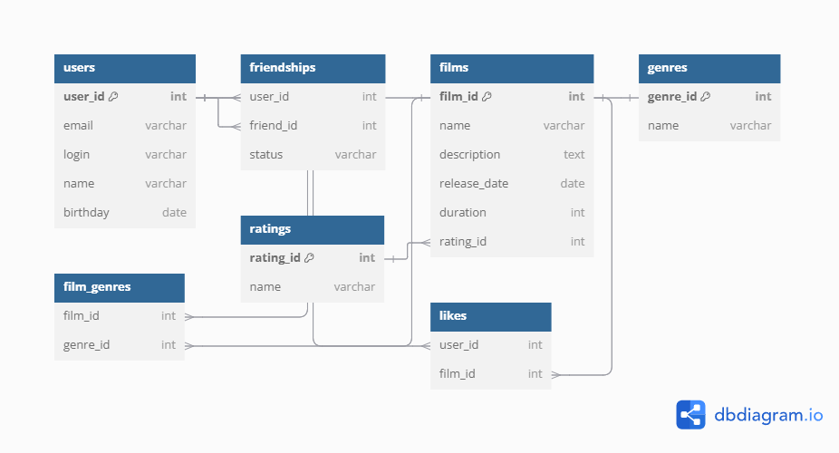

# java-filmorate
Template repository for Filmorate project.

## ER-диаграмма базы данных



### Альтернативный формат
Если вам требуется более качественное изображение или возможность увеличить диаграмму, вы можете скачать её в формате PDF:

[Скачать ER-диаграмму базы данных (PDF)](Filmorate_Database.pdf)

---

## Описание базы данных

База данных состоит из следующих основных таблиц:

- **`users`** — информация о пользователях:
    - `user_id` (PK) — уникальный идентификатор пользователя.
    - `email` — электронная почта пользователя.
    - `login` — логин пользователя.
    - `name` — имя пользователя.
    - `birthday` — дата рождения пользователя.

- **`films`** — информация о фильмах:
    - `film_id` (PK) — уникальный идентификатор фильма.
    - `name` — название фильма.
    - `description` — описание фильма.
    - `release_date` — дата выхода фильма.
    - `duration` — продолжительность фильма в минутах.
    - `rating_id` (FK) — ссылка на рейтинг фильма.

- **`genres`** — список доступных жанров:
    - `genre_id` (PK) — уникальный идентификатор жанра.
    - `name` — название жанра (например, «Комедия», «Драма»).

- **`ratings`** — возрастные рейтинги фильмов:
    - `rating_id` (PK) — уникальный идентификатор рейтинга.
    - `name` — название рейтинга (например, «G», «PG», «R»).

- **`friendships`** — связь пользователей для учёта статуса дружбы:
    - `user_id` (FK) — идентификатор пользователя.
    - `friend_id` (FK) — идентификатор друга.
    - `status` — статус дружбы: «подтверждённая» или «неподтверждённая».

- **`film_genres`** — связь фильмов с жанрами:
    - `film_id` (FK) — идентификатор фильма.
    - `genre_id` (FK) — идентификатор жанра.

- **`likes`** — информация о лайках фильмов пользователями:
    - `film_id` (FK) — идентификатор фильма.
    - `user_id` (FK) — идентификатор пользователя.

---

## Примеры SQL-запросов

### 1. Получить список всех пользователей:
```sql
SELECT * FROM users;
```

### 2. Найти друзей пользователя с ID 1:
```sql
SELECT u.* 
FROM friendships f
JOIN users u ON f.friend_id = u.user_id
WHERE f.user_id = 1 AND f.status = 'confirmed';
```

### 3. Получить топ-3 популярных фильмов по количеству лайков:
```sql
SELECT f.film_id, f.name, COUNT(l.user_id) AS likes_count
FROM films f
LEFT JOIN likes l ON f.film_id = l.film_id
GROUP BY f.film_id
ORDER BY likes_count DESC
LIMIT 3;
```

### 4. Найти общих друзей для пользователей с ID 1 и ID 2:
```sql
SELECT u.* 
FROM friendships f1
JOIN friendships f2 ON f1.friend_id = f2.friend_id
JOIN users u ON f1.friend_id = u.user_id
WHERE f1.user_id = 1 AND f2.user_id = 2 AND f1.status = 'confirmed' AND f2.status = 'confirmed';
```

### 5. Получить фильмы определённого жанра (например, "Комедия"):
```sql
SELECT f.*
FROM films f
JOIN film_genres fg ON f.film_id = fg.film_id
JOIN genres g ON fg.genre_id = g.genre_id
WHERE g.name = 'Комедия';
```